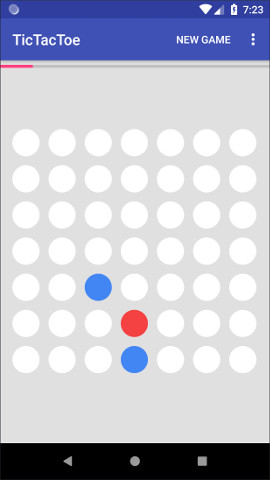
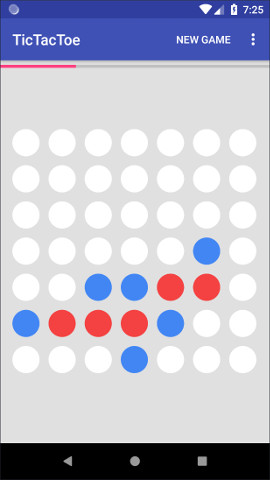
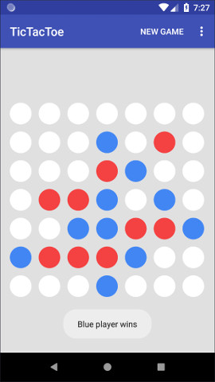

# TicTacToe

This project is built around NN-based agent playing an enhanced version of tic-tac-toe.

The project began as a classic tic-tac-toe game played against MCTS agent, but that wasn't fun and
I had to make the game more complex. As a result I came up with the game which has the same basic
idea: the first player to get 4 pieces in a line wins. The board size is 7x7. It has space for different strategies and is learnable within reasonable time frame using a single GPU. I replaced classic MCTS with probabilistic version based on NN, which is responsible for evaluating
board states and predicting moves.

The model was trained in [BoardAI] project and used here only for inference.

## Dependencies

* Android SDK v27
* Android Support Repository v27.1.1
* Android Tensorflow v1.7.0

## Getting Started

This project uses the Gradle build system. To build this project, use the "gradlew build" command
or use "Import Project" in Android Studio.

## License

MIT License

Copyright (c) 2018 Alex Baryzhikov

Permission is hereby granted, free of charge, to any person obtaining a copy
of this software and associated documentation files (the "Software"), to deal
in the Software without restriction, including without limitation the rights
to use, copy, modify, merge, publish, distribute, sublicense, and/or sell
copies of the Software, and to permit persons to whom the Software is
furnished to do so, subject to the following conditions:

The above copyright notice and this permission notice shall be included in all
copies or substantial portions of the Software.

THE SOFTWARE IS PROVIDED "AS IS", WITHOUT WARRANTY OF ANY KIND, EXPRESS OR
IMPLIED, INCLUDING BUT NOT LIMITED TO THE WARRANTIES OF MERCHANTABILITY,
FITNESS FOR A PARTICULAR PURPOSE AND NONINFRINGEMENT. IN NO EVENT SHALL THE
AUTHORS OR COPYRIGHT HOLDERS BE LIABLE FOR ANY CLAIM, DAMAGES OR OTHER
LIABILITY, WHETHER IN AN ACTION OF CONTRACT, TORT OR OTHERWISE, ARISING FROM,
OUT OF OR IN CONNECTION WITH THE SOFTWARE OR THE USE OR OTHER DEALINGS IN THE
SOFTWARE.

[BoardAI]: https://github.com/Postmodernist/BoardAI
